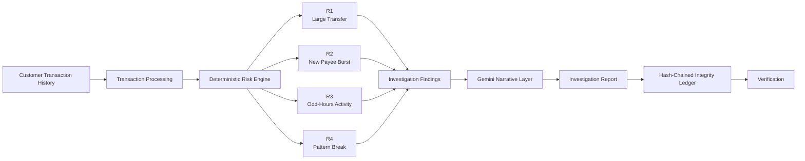

TRACK_ID=PS06

# PS06 — Transaction Risk Investigation Assistant

<div align="center">

### TRACK ID: PS06

**Evidence-Based Transaction Risk Investigation for Banking**

<br>


</div>

---

## Overview

PS06 — Transaction Risk Investigation Assistant is a banking fraud-desk investigation system that analyzes a single customer's transaction history using deterministic risk rules.

The system identifies unusual transaction patterns, connects each finding to the exact transaction evidence, and generates an investigator-facing report.

The system does **not** determine whether fraud occurred.

---

## Investigation Flow



---

## Risk Detection Engine

The deterministic rule engine is implemented in:

```text
src/rules_engine.py
```

|  Rule  | Detection                                |
| :----: | :--------------------------------------- |
| **R1** | Unusually Large Transfer                 |
| **R2** | Burst of Payments to a Newly Added Payee |
| **R3** | Odd-Hours Activity                       |
| **R4** | Break From Established Pattern           |

The deterministic rule engine is the only component responsible for deciding whether a transaction pattern is flagged.

---

## Evidence-Based Investigation

Each finding references the original transaction evidence.

```text
Customer Transaction
        |
        v
Rule Evaluation
        |
        v
Risk Finding
        |
        v
Evidence Verification
        |
        v
Investigation Report
```

The LLM receives only evidence already identified by the deterministic rule engine.

---

## Gemini Narrative Layer

Gemini is used only to convert an established finding into an investigator-facing explanation.

```text
Deterministic Finding
        |
        v
Rule + Evidence
        |
        v
Gemini
        |
        v
Investigator Narrative
```

If Gemini is unavailable, the system automatically uses a deterministic template.

Each finding contains:

```text
narrative_source
```

This identifies whether the narrative came from Gemini or the deterministic fallback.

---

## Payee Normalization

The system uses Gemini embeddings to identify similar payee descriptions.

```text
"AMAZON PAY"
"AMAZON MARKETPLACE"
"AMZN MARKETPLACE"
        |
        v
Embedding
        |
        v
Cosine Similarity
        |
        v
Normalized Payee
```

If embeddings are unavailable, the system falls back to exact-string matching.

---

## Local Integrity Ledger

Every completed report is stored in an append-only hash chain.

```text
Genesis
   |
   v
Report 01
   |
   v
Report 02
   |
   v
Report 03
   |
   v
Report 04
```

Each entry contains the hash of the previous entry.

Verification endpoint:

```text
GET /api/ledger/verify
```

The ledger is a local tamper-evident mechanism and is not a distributed blockchain.

---

## Customer Scenarios

| Customer                   | Scenario                         | Expected Finding |
| :------------------------- | :------------------------------- | :--------------: |
| `cust_101_clean`           | Routine transaction history      |    No findings   |
| `cust_102_large_transfer`  | Large out-of-pattern transfer    |        R1        |
| `cust_103_new_payee_burst` | New payee payment burst          |        R2        |
| `cust_104_odd_hours`       | Large late-night ATM withdrawals |      R2 + R3     |
| `cust_105_pattern_break`   | New category with large amount   |      R1 + R4     |

---

## Demo

<div align="center">

### PS06 Investigation Dashboard

**Transaction Analysis → Risk Detection → Evidence → Report → Integrity Verification**

<br>

<a href="https://youtu.be/aVX0AmZ_W2s">
  
</a>

<br><br>

**Click the preview above to watch the complete project demonstration.**

</div>

---

## How to Run

```bash
pip install -r requirements.txt
python app.py
```

Open:

```text
http://localhost:8000
```

### Windows PowerShell

```powershell
$env:GEMINI_API_KEY="YOUR_API_KEY"
python app.py
```

The application remains functional without Gemini by using deterministic fallbacks.

---

## Project Structure

```text
transaction-risk-investigator/
│
├── app.py
├── requirements.txt
├── README.md
│
├── data/
│   ├── risk_rules.json
│   └── customers/
│
├── scripts/
│   └── generate_data.py
│
└── src/
    ├── rules_engine.py
    ├── payee_normalizer.py
    ├── report_builder.py
    └── ledger.py
```

---

## Technology Stack

| Layer         | Technology              |
| :------------ | :---------------------- |
| Backend       | Python                  |
| Web Framework | Flask                   |
| Frontend      | HTML / CSS / JavaScript |
| Risk Engine   | Deterministic Python    |
| AI            | Google Gemini           |
| Embeddings    | Gemini Embeddings       |
| Data          | CSV                     |
| Integrity     | Hash Chain              |
| API           | JSON REST-style API     |

---

## Design Principles

* Deterministic risk detection
* Evidence traceability
* LLM-assisted narrative generation
* Graceful degradation without Gemini
* Human-in-the-loop investigation
* Tamper-evident report history
* No automated fraud verdict

---

## PS06 Core Principle

<div align="center">

**Detect patterns. Preserve evidence. Explain findings. Keep the final decision with the investigator.**

<br>

**PS06 — Transaction Risk Investigation Assistant**

</div>
